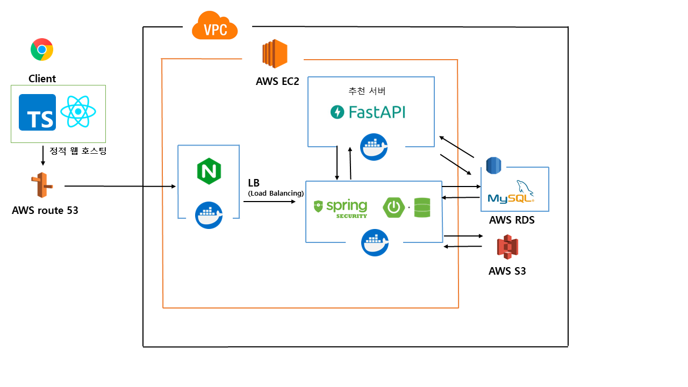

# 프로젝트 협업 SNS 서비스

<br/>

## Table of Contents

- [개요](#개요)
- [Skils](#skils)
- [Installation](#Installation)
- [Directory](#Directory)
- [API Reference](#api-reference)
- [프로젝트 진행 및 이슈 관리](#프로젝트-진행-및-이슈-관리)
- [구현과정(설계 및 의도)](<#구현과정(설계-및-의도)>)
- [TIL 및 회고](#til-및-회고)
- [Authors](#authors)
- [References](#references)

<br/>

## 개요


본 서비스는 사용자들이 팀 프로젝트를 모집, 진행, 관리하는데 도움을 주며 SNS 기능을 가진 애플리케이션입니다. 이 앱은 진행중인 팀 프로젝트를 모니터링하고 
사용자들에게 프로젝트, 게시글, 팀원을 추천하여 프로젝트를 쉽고 편하게 진행하고자 하는 목표 달성에 도움이 됩니다.

**(프로젝트, 게시글, 팀원을 추천하는 기능을 통해 원활한 프로젝트 진행을 지원합니다)**


## Infra Architecture



## Skills

<div align="center">


&nbsp;
&nbsp;
&nbsp;
&nbsp;
&nbsp;
&nbsp;

<br>

[//]: # (&nbsp;)
[//]: # (&nbsp;)
&nbsp;
&nbsp;
&nbsp;

[//]: # (&nbsp;)
&nbsp;

[//]: # (&nbsp;)
[//]: # (&nbsp;)
<br>


&nbsp;
&nbsp;
&nbsp;

<br>


</div>


## 서비스 최종 성능 정리

**기능 API**
- Oauth 로그인 기능, JWT 토큰 인증, 인가
- 게시글, 프로젝트, 유저 추천
- 게시글, 프로젝트, 유저 조회
- 프로젝트 업무 티켓 관리 (칸반보드 형식)
- 프로젝트 신청, 수락, 거절
- 프로젝트 평가


## Directory

<details>
<summary> 파일 구조 보기 </summary>

```
src
├─domain
│   ├─apply
│   │  ├─controller
│   │  ├─dto
│   │  ├─repository
│   │  ├─service
│   │  └─Apply
│   ├─auth
│   │  ├─controller
│   │  ├─entity
│   │  ├─info
│   │  ├─repository
│   │  ├─service
│   │  └─token
│   ├─comment
│   │  ├─controller
│   │  ├─dto
│   │  ├─repository
│   │  ├─service
│   │  └─Comment
│   ├─follow
│   │  ├─controller
│   │  ├─dto
│   │  ├─repository
│   │  ├─service
│   │  └─Follow
│   ├─image
│   │  ├─controller
│   │  ├─dto
│   │  ├─repository
│   │  ├─service
│   │  └─Image
│   ├─notice
│   │  ├─controller
│   │  ├─dto
│   │  ├─repository
│   │  ├─service
│   │  └─Notice
│   ├─notification
│   │  ├─controller
│   │  ├─dto
│   │  ├─repository
│   │  ├─service
│   │  └─Notification
│   ├─post
│   │  ├─controller
│   │  ├─dto
│   │  ├─repository
│   │  ├─service
│   │  └─Post
│   ├─postlike
│   │  ├─controller
│   │  ├─dto
│   │  ├─repository
│   │  ├─service
│   │  └─PostLike
│   ├─project
│   │  ├─controller
│   │  ├─dto
│   │  ├─repository
│   │  ├─service
│   │  └─Project
│   ├─projectlike
│   │  ├─controller
│   │  ├─dto
│   │  ├─repository
│   │  ├─service
│   │  └─ProjectLike
│   ├─projectuser
│   │  ├─controller
│   │  ├─dto
│   │  ├─repository
│   │  ├─service
│   │  └─ProjectUser
│   ├─rate
│   │  ├─controller
│   │  ├─dto
│   │  ├─repository
│   │  ├─service
│   │  └─Rate
│   ├─schedule
│   │  ├─controller
│   │  ├─dto
│   │  ├─repository
│   │  ├─service
│   │  └─Schedule
│   └─user
│      ├─controller
│      ├─dto
│      ├─repository
│      ├─service
│      └─User
└─system
    ├─common
    ├─config
    │  └─properties
    ├─exception
    ├─filter
    ├─handler
    └─utils
```

</details>
<br/>


## API Reference

### [Swagger-API](https://synergyy.link/api/api-docs/swagger-ui/index.html)

<br/>

[//]: # (## 프로젝트 진행 및 이슈 관리)

[//]: # ()
[//]: # ([//]: # &#40;[![Notion]&#40;https://img.shields.io/badge/Notion-%23000000.svg?style=for-the-badge&logo=notion&logoColor=white&#41;]&#40;https://www.notion.so/Team-Careerly-8d62334735154f7f9b9cbba91da21df5&#41;&#41;)
[//]: # ()
[//]: # ([//]: # &#40;[프로젝트 관리 페이지]&#40;https://www.notion.so/Team-Careerly-8d62334735154f7f9b9cbba91da21df5&#41;&#41;)
[//]: # ()
[//]: # ()

<br/>


## ERD


<details>
<summary>테이블 관계 - click</summary>

- 주요 도메인으로 user, post, project, notification 으로 나눈다
- Project 와 Category 관계
    - Category를 하나의 테이블로 만들것인가 ? (정규화 고려)
    - 혹은 Enum으로만 관리할 것 인가 ?
        - Enum으로 관리한다(Field로 이름 변경)
            - Enum 만으로도 분류가 가능하기 때문
            - 추가적으로 분류에 대한 성능개선이 필요하거나 수요 증가가 예상될 경우 Entity로 구현을 고려하여 정규화를 진행한다
- Project 와 User 관계
    - Project 와 User는 N 대 N 관계로 설정한다. 이유는 Project(프로젝트)는 User(사용자) 를 여러명 가질 수 있고 반대로 User는 여러 Project를 수행할 수 있으므로
        - 추가로 고려할 사항
            - Project의 요구사항이 늘어남에 따라 User의 정보를 Project 내에서도 양방향 관계로 관리하는게 맞을까 ?
            - 현재는 Project가 여러 User를 가진다는 개념이므로 양방향으로 매핑을 해주자

         
</details>

## Main Service Architecture


## User Service

고객의 회원 가입, 로그인, 회원 정보 변경, 회원 정보 조회 등의 기능을 제공하는 서비스입니다.
- OAuth와 JWT를 활용하여 회원의 인증과 인가 처리를 수행하며, 이를 통해 소셜 로그인 시 Access Token과 Refresh Token을 이용하여 인증 과정을 완료합니다.

기능
- 로그인(첫 소셜로그인시 자동 회원가입)
- 회원 정보 변경

### API Lists
- login (users/auth/login)
  - 로그인, 회원가입을 수행합니다. 로그인 성공시 token을 발급하며 이후 요청에 대해서 해당 토큰으로 인증을 진행합니다.
- updateMyInfo (users/me/info)
  - 회원 정보를 변경합니다.

#### Using stack
- Spring Boot, Java 11, Spring Data JPA, Mysql, Lombok, Gradle, JWT

### Sequence Diagram Example (회원 가입, JWT 토큰 인증 프로세스)


## Recommend Service

사용자가 가진 활동들을 바탕으로 사용자에게 알맞는 컨텐츠(게시글, 프로젝트, 유저)를 추천해주는 기능을 제공하는 서비스입니다.
- 추천 알고리즘으로 채택한 LightFM 모델은 콘텐츠 기반 방식과 협업 필터링을 결합한 하이브리드 행렬 분해 모델
  - 채택한 이유는 사용자와 아이템을 그들의 콘텐츠 특성의 잠재 요인들로 표현하며, 상호작용 데이터가 부족한 콜드 스타트 상황에서도 효과적이므로
    - 추천 기능이 동작하는 FastAPI 서버를 docker Image화 하여 docker 컨테이너 위에서 실행 (메인서버 또한 Image화 하여 컨테이너위에서 실행)
    - DB와 메인 서버로부터 데이터와 API 요청을 받아 모델학습 및 추천을 수행

### API List

- getRecommendProjects (projects/recommend)
  - 유저 활동을 바탕으로 적합한 프로젝트를 추천합니다.
- getRecommendPosts (posts/recommend)
  - 유저 활동을 바탕으로 적합한 게시글을 추천합니다.
- getSimilarUsers (users/recommend)
  - 유저 활동을 바탕으로 적합한 유저를 추천합니다.

### Sequence Diagram Example (컨텐츠 추천 프로세스)


## Project Service

사용자가 팀원을 구성하며 팀 프로젝트를 진행하며 공지시항, 일정, 티켓 관리, 평가 등의
기능을 제공하는 서비스입니다.

- 티켓 관리 기능의 경우 티켓을 칸반보드로 관리하는 기능으로 각 Status별로 나누어 티켓들을 올바른 위치로 이동하게끔 구현

### API List
- changePositionTicket (tickets/change/{ticketId})
  - 티켓 위치 변경 기능을 제공합니다.

### Sequence Diagram Example (프로젝트 팀원 참가 신청 프로세스)


### Sequence Diagram Example (티켓 위치 변경 프로세스)


<br/>

## 영상시연

### 소셜로그인, 팔로우

[](https://youtu.be/ne0khow7KBA)

### 무한스크롤

[](https://youtu.be/Tb8-YXE3J3s)

### 컨텐츠 추천

[](https://youtu.be/k3OdyvLg4tA)

### 프로젝트 수락, 일정

[](https://youtu.be/mh83y4dR-GI)

### 프로젝트 공지 알림

[](https://youtu.be/CZYQZoSnvqY)

### 프로젝트 티켓 칸반보드 관리

[](https://youtu.be/orqXubqKGBU)

### 프로젝트 상호 평가

[](https://youtu.be/KgL8eeUBme0)


## 주요 PR

- [티켓 위치 수정](https://github.com/TeamSynergyy/synergy_be/pull/36)
- [동료평가 반영](https://github.com/TeamSynergyy/synergy_be/pull/25)
- [알림 기능](https://github.com/TeamSynergyy/synergy_be/pull/39)

## 발표 PPT

### [시너지_발표](https://docs.google.com/presentation/d/1ZZ_jbi9zRloYs5IJkX9ezwv8QXJWYjZMm2bKW8nblM0/edit#slide=id.g2640e909904_1_91)


## 앞으로 진행할 내용들

**대용량 트래픽 처리**
- 가상 사용자 1천명 -> Jmeter로 진행 예정

**github ci-cd**
- 빌드 및 배포 자동화

### 기술도입 배경
내용 작성

<br/>

## Authors

<div align="center">

<br/>

 </br>
<a href="https://github.com/rivkode">이종훈</a>

</div>
<br/>

## References

- [Awesome Readme Templates](https://awesomeopensource.com/project/elangosundar/awesome-README-templates)
- [Awesome README](https://github.com/matiassingers/awesome-readme)
- [How to write a Good readme](https://bulldogjob.com/news/449-how-to-write-a-good-readme-for-your-github-project)